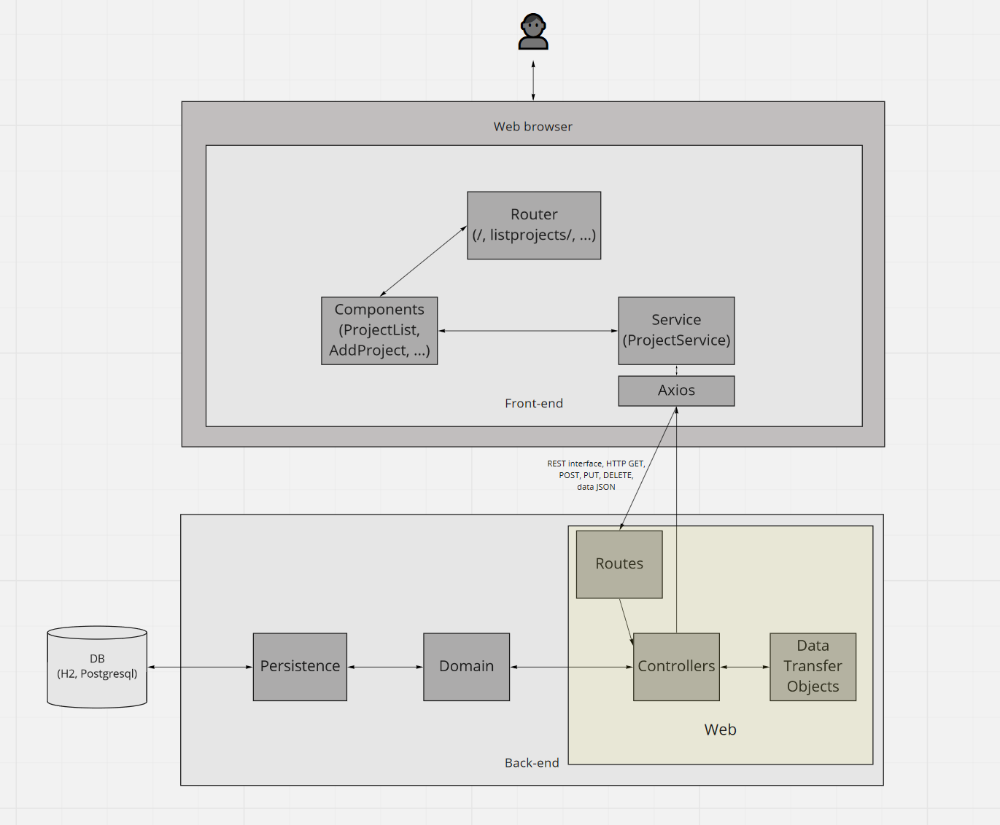
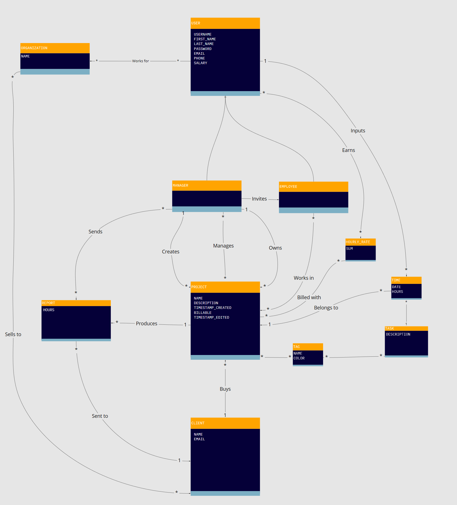
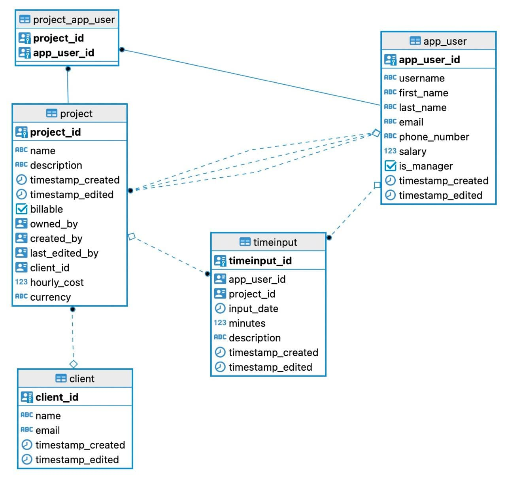

<!-- markdown-toc start - Don't edit this section. Run M-x markdown-toc-refresh-toc -->
**Table of Contents**

- [Timesheets architectural overview](#timesheets-architectural-overview)
    - [Technologies](#technologies)
        - [Scala](#scala)
        - [sbt](#sbt)
        - [Scalafmt](#scalafmt)
        - [Play](#play)
        - [Database: Anorm, Evolutions, H2, and PostgreSQL](#database-anorm-evolutions-h2-and-postgresql)
        - [Build and deployment](#build-and-deployment)
        - [Dependency Injections](#dependency-injections)
        - [Scalatest](#scalatest)
    - [Architectural structure](#architectural-structure)
        - [Root scope](#root-scope)
        - [Packages](#packages)
- [Domain language](#domain-language)
    - [English](#english)
    - [Finnish](#finnish)
- [Tool installation](#tool-installation)
    - [openjdk](#openjdk)
    - [sbt](#sbt-1)
        - [PostgreSQL](#postgresql)
- [Database](#database)
    - [Schema](#schema)
    - [Known problems](#known-problems)
- [Swagger](#swagger)
    - [Known security vulnerability: `+ nocsrf`](#known-security-vulnerability--nocsrf)
- [Planned authorizations](#planned-authorizations)

<!-- markdown-toc end -->


# Timesheets architectural overview
The Timesheets app consists of a Scala Play backend (this repository) and a React Typescript frontend which communicate with each other via a REST API [documented in Swagger](https://codeflow-timesheets-staging.herokuapp.com/docs/swagger-ui/index.html?url=/swagger.json).
## Technologies
### Scala
The backend is written in [Scala](https://scala-lang.org/), a Java Virtual Machine (JVM) language.

### sbt
Scala build tool, [sbt](https://www.scala-sbt.org/), is used to build, run, and test the application. It uses the file [build.sbt](build.sbt) for defining the Scala version(s) and external libraries to be used.

### Scalafmt
[Scalafmt](https://scalameta.org/scalafmt/) formats code style so that it is consistent between developers. It can be run, for example, from the command line with `sbt scalafmt`. Scalafmt configurations are in [.scalafmt.conf](.scalafmt.conf).

### Play
The backend uses [Play Framework](https://www.playframework.com/) which is built on asynchronous [Akka](https://akka.io/). The Play configuration is found in file [conf/application.conf](conf/application.conf). It includes, for example, database and [CORS](https://developer.mozilla.org/en-US/docs/Web/HTTP/CORS) configurations. Routes are defined in file [conf/routes](conf/routes).

### Database: Anorm, Evolutions, H2, and PostgreSQL
The app uses [Anorm](https://playframework.github.io/anorm/) to access the database and parse query results. The framework is minimalist and uses plain SQL for database interaction.

The app uses [Play Evolutions](https://www.playframework.com/documentation/2.8.x/Evolutions) to handle and track changes to the database schema. The changes to the schema for each database are found in the directory with the same name (e.g. default, test, timesheet) under [conf/evolutions/](conf/evolutions/). The changes are arranged by files with integer names in an increasing order (1.sql, 2.sql, ...). Each file should have a section under `# --- !Ups` where new changes to the database schema are made, and another section under `# --- !Downs` where all the new changes are reverted back to the previous schema. 

The database can be configured to use the in-memory database [H2]/https://www.playframework.com/documentation/2.8.x/Developing-with-the-H2-Database) in development with PostgreSQL dialect, and actual [PostgreSQL](https://www.postgresql.org/) database in deployment and production. See files [conf/application.conf](conf/application.conf) and [conf/deploy.conf](conf/deploy.conf).

### Build and deployment
[Procfile](Procfile) and [conf/deploy.conf](conf/deploy.conf) include configurations with variables for building and deploying the application to Heroku, for example.

### Dependency Injections
[Dependency injections](https://www.playframework.com/documentation/2.8.x/ScalaDependencyInjection) are used especially to propagate the various configured database configurations throughout the application. The dependency injection uses, for example, `com.google.injected.ImpementedBy` to define which class implements the trait that is injected by annotation `@Inject` to other classes for use. Case classes and companion objects do not mix well with dependency injections.

### Scalatest
Testing uses [ScalaTest integrated with Play](https://www.playframework.com/documentation/2.8.x/ScalaTestingWithScalaTest). Test classes are defined by extending the `PlaySpec` trait.

## Architectural structure
The high level architectural view of the application including the frontend is presented in the figure below.



### Root scope
The root scope of the application code is `com.bytecraft.timesheets`.
### Packages
The structure for the layers and packages is as follows:

1.  Web

    1.  Views
    2.  Controllers
    3.  Data Transfer Objects (DTOs)

        Case Classes without methods

2.  Domain

    1.  Models

        Use case classes. Describe attributes and associations, but do not include methods.

        1. Project
        2. User
        3. Client
		4. ...

    2.  Services

        - Changes Data Transfer Objects to models and calls Data  Access Objects.
        - The data access operations should be in the persistence layer (e.g. dao.add()).
        - Changes data from Data Access Objects to Data Transfer Objects

3.  Persistence

    1.  Data Access Objects (DAOs)
		The DAOs access database.

# Domain language
The application is designed to process timesheets. The meanings of the terms are defined below. The associations between the concepts in the domain model are illustrated in the figure.



## English

| Concept           | Definition                                                                                                                                                              | Synonyms          |
| ----------------- | ----------------------------------------------------------------------------------------------------------------------------------------------------------------------- | ----------------- |
| Application       | The software program that tracks and maintains timesheets. Used by an organization.                                                                                     | App               |
| Application Owner | The individual or group with the responsibility to ensure that the program(s) making up the application accomplishes its objectives                                     |                   |
| Architecture      | Structural composition of the application and its supporting technologies                                                                                               |                   |
| Billing           | The process of preparing or sending invoices.                                                                                                                           |                   |
| Budget            | Project's planned costs in time and money.                                                                                                                              |                   |
| Client            | A person or organization using the services of a company. May buy several projects.                                                                                     | Customer<br>Buyer |
| Cost              | The time and money that has been used to execute a project.                                                                                                             |                   |
| Employee          | A person billing hours in a project but not having any administrative or managerial role.                                                                               |                   |
| Manager           | A person responsible for controlling or administering an organization or group of staff.                                                                                | Supervisor        |
| Project           | An individual or collaborative enterprise that is planned to achieve an aim. Takes time and one or more tasks to complete.                                              |                   |
| Report            | A human-readable and printable summary of a user-specified context.                                                                                                     |                   |
| Task              | A piece of work to be done or undertaken. Takes time.                                                                                                                   |                   |
| Task description  | Description of what work was done or how time was spent during a task.                                                                                                  | Comment           |
| Time              | The difference in numbers in a clock between the beginning and the end of a work session. Can be represented as hours with decimal fractions or with hours and minutes. |                   |
| Timesheets        | Collective record of tasks and time spent working. The main purpose of this application.                                                                                |                   |
| User              | A person who uses the application.                                                                                                                                      | End user          |

## Finnish

| Käsite               | Määritelmä                                                                                                                                      | Synonyymejä              |
| -------------------- | ----------------------------------------------------------------------------------------------------------------------------------------------- | ------------------------ |
| Sovellus             |                                                                                                                                                 |                          |
| Sovelluksen omistaja | Yksilö tai ryhmä, joiden vastuulla on, että sovelluksen muodostavat ohjelmat saavuttavat tavoitteensa.                                          |                          |
| Arkkitehtuuri        |                                                                                                                                                 |                          |
| Laskutus             | Kuittien tai laskujen valmistelu tai lähettämisprosessi.                                                                                        |                          |
| Budjetti             | Projektin suunnitellut tunti- ja rahalliset kustannukset.                                                                                       | Talousarvio              |
| Asiakas              | Henkilö tai organisaatio, joka käyttää yrityksen palveluja. Voi ostaa useita projekteja.                                                        | Toimeksiantaja<br>Ostaja |
| Kustannus            | Projektin suorittamiseen jo käytetyt tunnit ja raha.                                                                                            | Toteutunut kustannus     |
| Työntekijä           | Henkilö, joka tekee laskutettavia tunteja projekteissa, mutta ei ole johtavassa tai hallinnollisessa roolissa.                                  | Alainen                  |
| Manageri             | Henkilö, joka on vastuussa organisaation tai työntekijöiden hallinnoinnista.                                                                    | Johtaja<br>Esihenkilö    |
| Projekti             | Yksilön tai yhteinen hanke, joka on suunniteltu päämäärän saavuttamiseksi. Vie aikaa ja vaatii yhden tai useamman tehtävän.                     | Hanke<br>Urakka          |
| Raportti             | Ihmisselkoinen ja tulostettava yhteenveto halutusta asiasta                                                                                     |                          |
| Tehtävä              | Suoritettava työ, joka vie aikaa.                                                                                                               |                          |
| Tehtävän kuvaus      | Kuvaus tehdystä työstä tai kuinka aikaa käytettiin tehtävän suorittamiseen.                                                                     |                          |
| Aika                 | Erotus kellon numeroissa työsession alun ja ja lopen välillä. Voidaan esittää tunnin kymmenkantaisina desimaaleina tai tunteina ja minuutteina. |                          |
| Työaikakortti        | Tehtävien ja niiden viemän ajan luettelo                                                                                                        | Kellokortti              |
| Käyttäjä             | Henkilö joka käyttää sovellusta                                                                                                                 | Loppukäyttäjä            |

# Tool installation
Here are some instructions for installing the tools needed to develop this application.
## openjdk

- MacOS 
Install Homebrew: https://brew.sh
Then write on command line in Terminal.app:

    ```shell
    brew install openjdk
    ```

- Windows, Linux: https://openjdk.java.net/install/

## sbt
- MacOS 
Install Homebrew: https://brew.sh
Then write on command line in Terminal.app:
    ```shell
    brew install sbt
	```

- Windows: https://www.scala-sbt.org/download.html

- Linux: https://www.scala-sbt.org/1.x/docs/Installing-sbt-on-Linux.html


### PostgreSQL
If you want to install and use a local version of the PostgreSQL database instead of the H2 in-memory database, follow the instructions below:
1. Install and configure PostgreSQL

- MacOS
Install Homebrew: https://brew.sh
Then write on command line in Terminal.app:
    ```shell
    brew install postgresql
    pg_ctl -D /usr/local/var/postgres start
    psql
    ```

    ```sql
    CREATE ROLE "timesheet" SUPERUSER LOGIN ENCRYPTED PASSWORD 'insert your password here';
    ```
- Windows: https://www.postgresql.org/download/windows/
- Linux: https://www.postgresql.org/download/linux/
  ```shell
  sudo -u postgres -i
  psql
  ```
  ```sql
  CREATE ROLE "timesheet" SUPERUSER LOGIN ENCRYPTED PASSWORD 'insert your password here';
   ```

2.  [application.conf](application.conf):

    Configure the environmental variables to be the following:

        db.timesheet.driver=org.postgresql.Driver

        db.timesheet.url="jdbc:postgresql://localhost:5432/postgres"

        db.timesheet.username=timesheet

        db.timesheet.password=insert your password hee

# Database

The data is made to persist in a relational SQL database. We assume the database is either a PostgreSQL database or H2 database with PostgreSQL syntax.

## Schema
The current database schema is the following:



## Known problems

There is a conflict when adding new information from frontend to the database and then rolling evolutions back


# Swagger

The application uses Swagger with annotations to document the API from the code. The documentation can be accessed via HTLM interface: <https://codeflow-timesheets-staging.herokuapp.com/docs/swagger-ui/index.html?url=/swagger.json>

## Known security vulnerability: `+ nocsrf`

In order to get `POST` API calls working in Swagger UI, we had to disable Play's CSRF by adding `+ nocsrf` annotation above the affected routes in the [file:./conf/routes](./conf/routes) file. This creates a security vulnerability.

# Planned authorizations
Certain API requests should be accessible only to users with certain roles or identities.

| Routes                              | Affected methods                         | Use case                                           | Manager | Employee | Specific user |
| ----------------------------------- | ---------------------------------------- | -------------------------------------------------- | ------- | -------- | ------------- |
| GET _projects:id_/hours             | TimeInputController.byProject            | User can view own timeinputs.                      |         |          | x             |
| POST /hours                         | TimeInputController.add                  | User can add own timeinputs.                       |         |          | x             |
| PUT /hours                          | TimeInputController.update               | User can edit own timeinputs.                      |         |          | x             |
| GET /projects                       | ProjectController.listProjects           | User can view own projects.                        |         |          | x             |
| GET /projects                       | ProjectController.listProjects           | Manager can view all projects.                     | x       |          |               |
| POST /projects                      | ProjectController.addProject             | Manager can add a project.                         | x       |          |               |
| GET /clients                        | ClientController.listClients             | Manager can add a project.                         | x       |          |               |
| GET /managers                       | ManagerController.listManagers           | Manager can add a project.                         | x       |          |               |
| GET /clients                        | ClientController.listClients             | Manager can generate a billing report.             | x       |          |               |
| GET _clients:id_/projects           | ProjectController.listProjectsByClientId | Manager can generate a billing report.             | x       |          |               |
| GET /projects/employees             | ProjectController.getUsersByProject      | Manager can generate a billing report.             | x       |          |               |
| GET report/_client:id_              | ReportController.getClientReport         | Manager can generate a billing report.             | x       |          |               |
| GET /employees                      | EmployeeController.listEmployees         | Manager can generate a salary report for anyone.   | x       |          |               |
| GET employees/_employee:id_/clients | EmployeeController.listClientsOfEmployee | Manager can generate a salary report for anyone.   | x       |          |               |
| GET report/_employee:id_            | ReportController.getSalaryReport         | Manager can generate a salary report for anyone.   | x       |          |               |
| GET _employees:id_/clients          | EmployeeController.listClientsOfEmployee | Employee can generate a salary report for oneself. |         |          | x             |
| GET report/_employee:id_            | ReportController.getSalaryReport         | Employee can generate a salary report for oneself. |         |          | x             |
